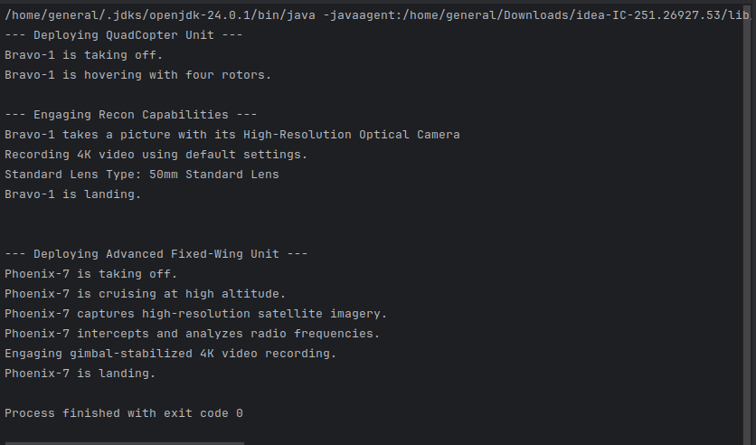
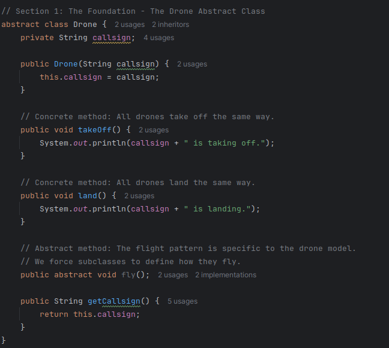
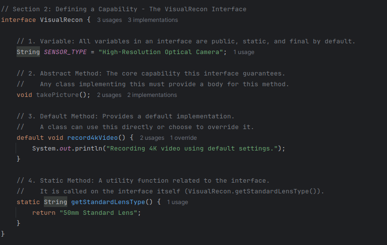
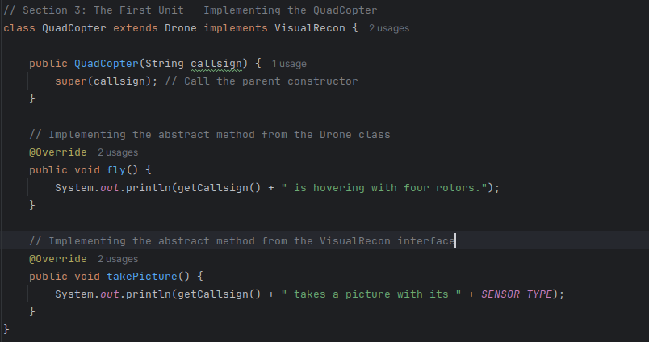
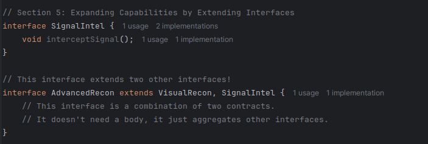
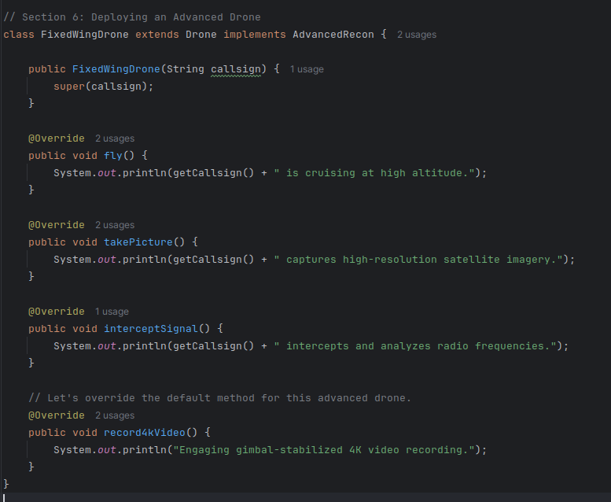
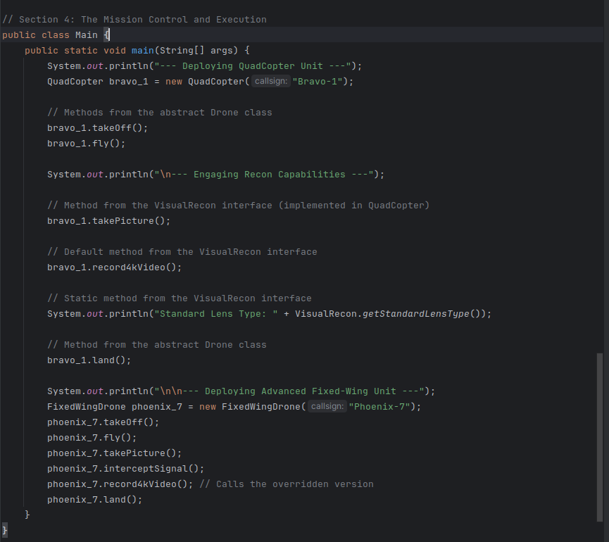

# JC-Exploring-Cadet-Training-Module

## General Malit

### Program Output

---

### Drone Abstract Class

### VisualRecon Interface

### QuadCopter Class

### SignalIntel and AdvancedRecon Interface

### FixedWingDrone Class

### MissionControl Class (Main Execution)

